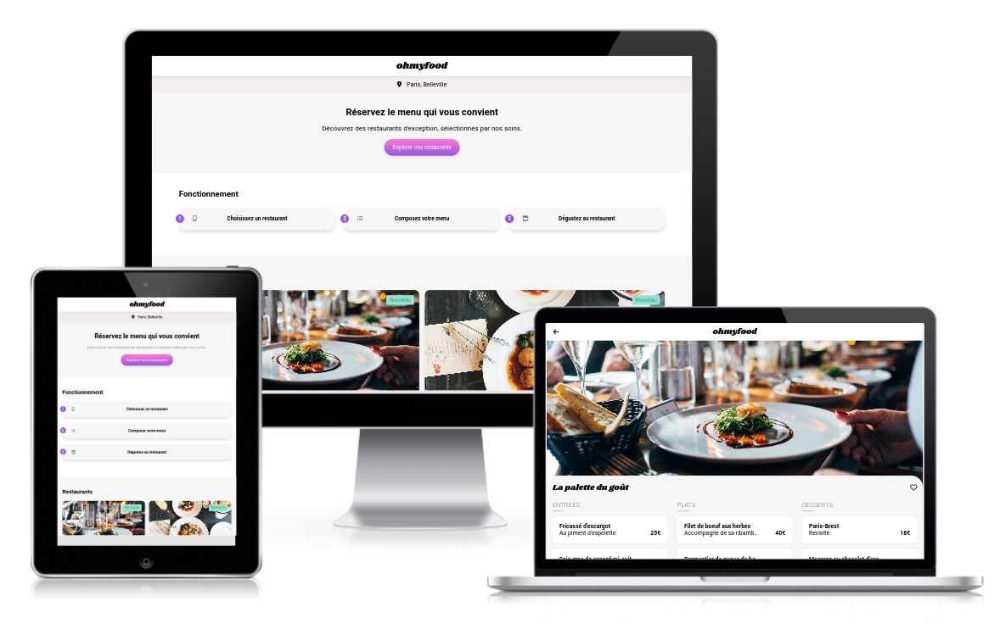

# oc-p3-ohmyfood
This project is the n°3 in the [OpenClassrooms Front-End learning path](https://openclassrooms.com/fr/paths/516-developpeur-dapplication-javascript-react).

**Ohmyfood!** is a young startup based in New York. They plan to offer their services in Paris market.

I worked on the integration of the website according to the mockup in mobile first. I've also added all animations.
  
## ✨ Demo
- https://jeromeabel.github.io/oc-p3-ohmyfood/

## 🚀 Usage
Just open the index.html in your browser, and you can click on different cards to navigate.

## 👤 Author

- [@jeromeabel](https://github.com/jeromeabel)

## 📝 License

- [GNU--GPL--3](https://www.gnu.org/licenses/gpl-3.0.fr.html)